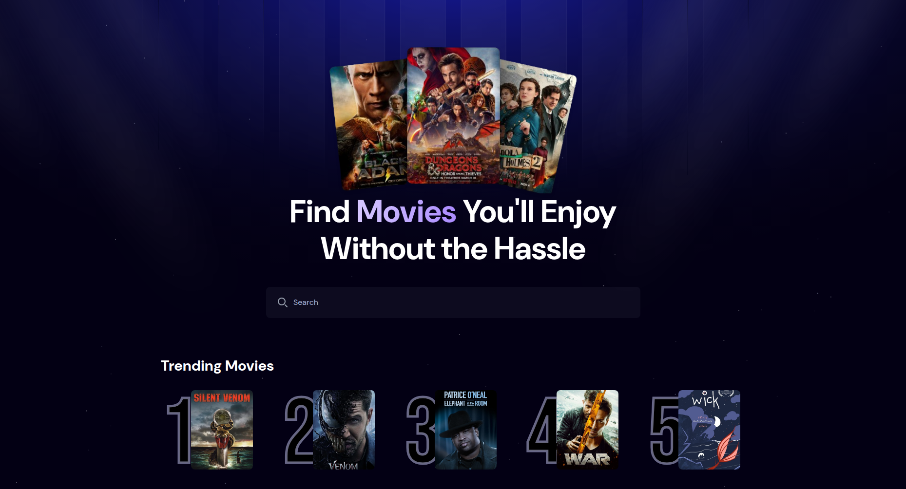
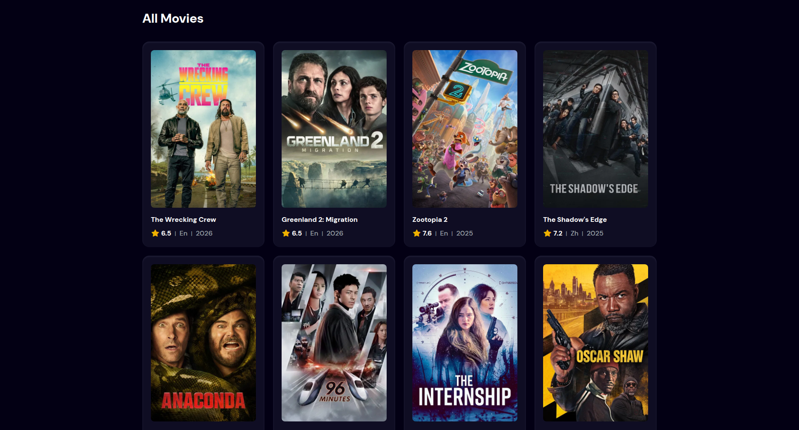

# Movikeer - Movie Browser

A React-based movie browsing application that lets users search and discover movies using real-time data from TMDB API.

🔗 **[Live Demo](https://movikeer.netlify.app/)**

## Features

- Real-time movie search
- Browse movies with poster, title, and rating displayed
- Trending searches powered by Appwrite
- Fast and responsive interface
- Movie details page (coming in next update)

## Tech Stack

- React
- TailwindCSS
- Vite
- TMDB API
- Appwrite (backend-as-a-service)
- Netlify (deployment)

## Screenshots

Browse and search through thousands of movies with an easy-to-use interface.
